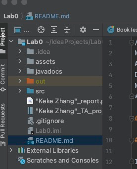
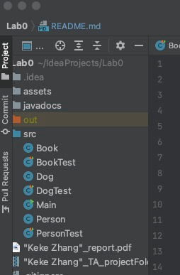
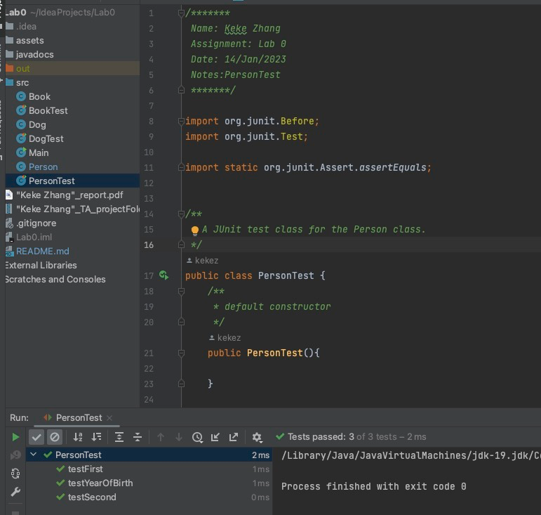
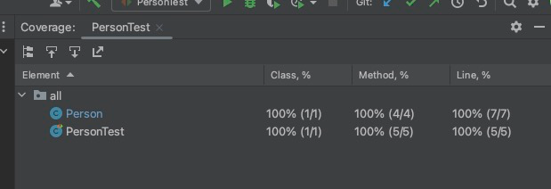
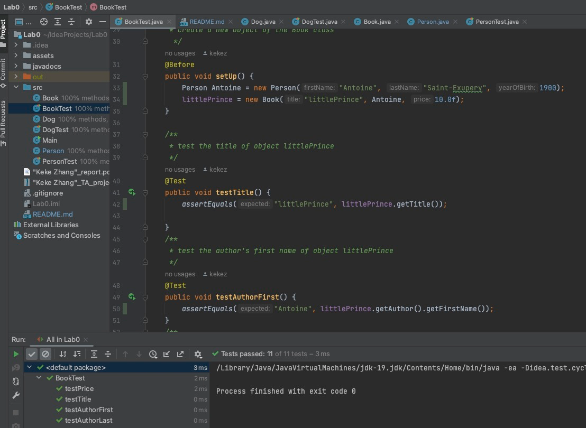
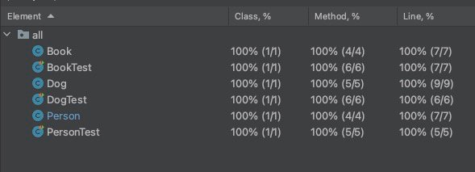

/*******
Name: Keke Zhang
Assignment: Lab 0
Date: 14/Jan/2023
Notes:Report
*******/

# Report

## 1 reflection

I get familiar with the three ways to compile a program, learn the basics of running a program and how to create class object and run it.

## 2 Screenshots

### create a project in my IDE

### add Book.java and Person.java to my project

### add the PersonTest.java to my project and verify that all the PersonTests test cases pass.

### view the level of coverage PersonTests currently offers.

### create a JUnit test class for the Book class and all the public methods of the Book class work as expected.

### checking the level of coverage

## 3 Extension

I create my own class object and test class (Dog.java and DogTest.java)
I submit my con code as a Github link instead.

## 4 Grading Statement

Based on the rubric, i think i could get 28-29
