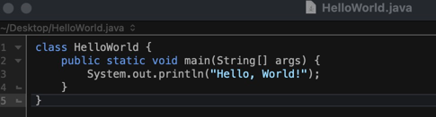
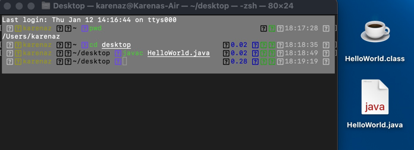
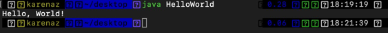
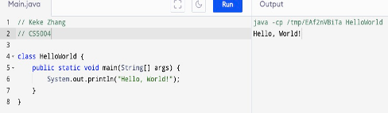
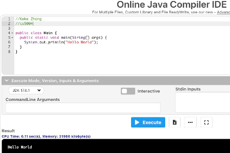
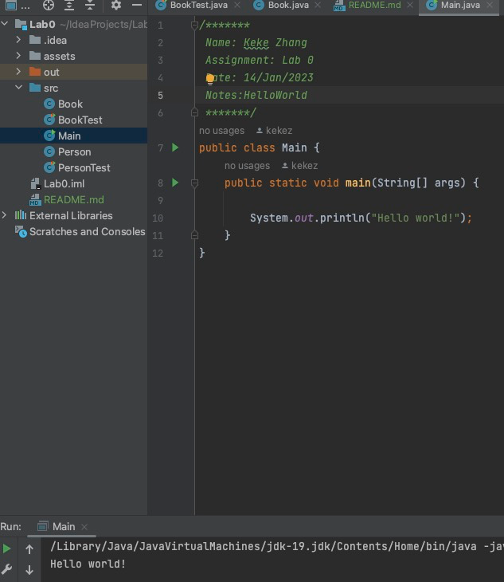

/*******
Name: Keke Zhang
Assignment: Lab 0
Date: 14/Jan/2023
Notes:Report
*******/

# Report

## 1 reflection

I get familiar with the three ways to compile a program, learn the basics of running a program and how to create class object and run it.

## 2 Screenshots

### Part 1

I create a "Hello World" Java program with my text editor(bbedit)

Use the javac command to compile the text file to a .class file

run the application using the java command.

### Part 2

I use a search engine locate 2 cloud compilers to create a "Hello World" application in each.

### Part 3

I installed the IntelliJ, and create a project, in this project create a Hello world application.

### Part 4

Java Tutorial for Beginners

https://www.youtube.com/watch?v=eIrMbAQSU34
This is a popular video of Java tutorial for Beginners in Youtube, in this video I will learn enough Java basic knowledge.

[Coursera](https://www.coursera.org/)
This is another popular platform where I can find a lot of resources to learn Java, and it provides some learning resources from tech companies like Google, and top universities like Harvard.

[Udemy](https://www.udemy.com/course/introduction-to-java-programming/?LSNPUBID=JVFxdTr9V80&ranEAID=JVFxdTr9V80&ranMID=39197&ranSiteID=JVFxdTr9V80-2J1ScM4a9cl0FJWniwG0Uw&utm_medium=udemyads&utm_source=aff-campaign)
I love this website because it is a good website to learn Java and coding online. it provides a lot of free courses like Java and programming.

[Codecademy](https://www.codecademy.com/learn/learn-java?periods=year&utm_source=pepperjam&utm_medium=affiliate&utm_term=214453&clickId=4248314851&pj_creativeid=8-12462&pj_publisherid=214453)
It provides an IDE that I can not only code but also can check my program by debugging it.

## 3 Extension

I create my own class object and test class (Dog.java and DogTest.java)
I submit my con code as a Github link instead.

## 4 Grading Statement

Based on the rubric, i think i could get 28-29
